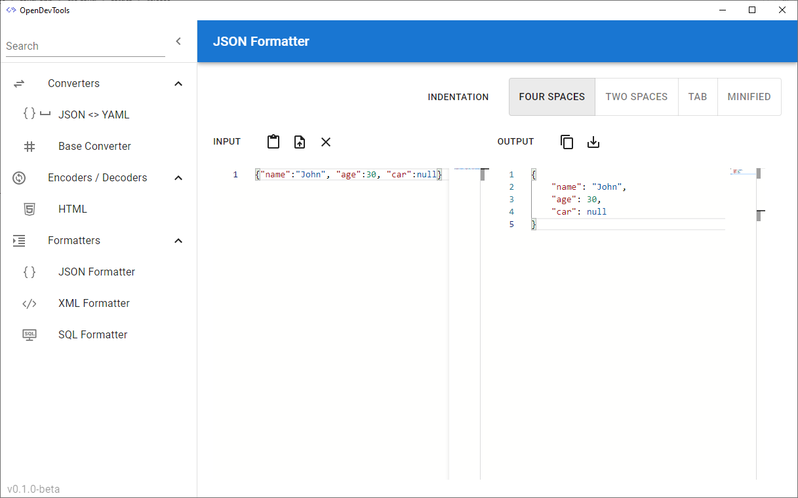

  

# OpenDevTools

## Introduction

OpenDevTools is a collection of tools bundled to cater the day-to-day needs of developers.\
No need to take your data to untrusted/closed-source sites to perform simple tasks.\
Tools available:
- Converters
  - JSON <> YAML
  - Base Converter
- Encoders/Decoders
  - HTML Encoder
- Formatters
  - JSON Formatter
  - XML Formatter
  - SQL Formatter

and many more to be added!

## How to install

Download the OS specific setup from the [releases](https://github.com/a-khanna/OpenDevTools/releases) page.\
For Windows, use *.msi installer file.\
For Linux, use *.AppImage or .deb file.\
For MacOS, use *.tar.gz or *.dmg file.

## Architecture

OpenDevTools is a cross-platform application built using the [Tauri](https://tauri.studio) framework. Tauri is based on Microsoft Edge-similar webview and Rust. Read about tauri [here](https://tauri.studio/en/docs/about/intro)\
The underlying UI is based on React.

## Contributing

We highly encourage and appreciate contributions!\
[Open issues](https://github.com/a-khanna/OpenDevTools/issues) and [Feature Requests](https://github.com/a-khanna/OpenDevTools/discussions) are the best ways to do so.

## License

[MIT](https://github.com/a-khanna/OpenDevTools/blob/main/LICENSE)
